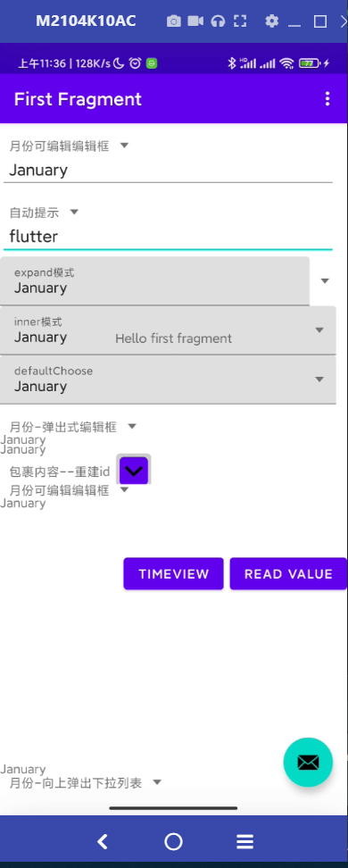
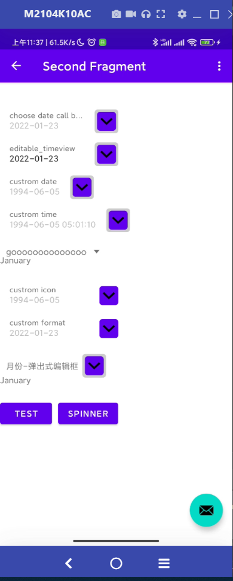
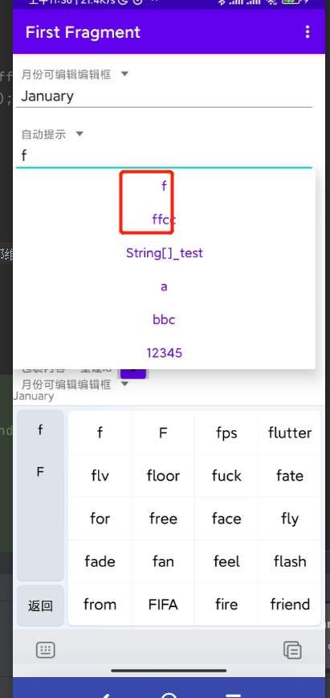

#AddDependent

```groovy
	allprojects {
		repositories {
			maven { url 'https://jitpack.io' }
		}
	}


```

or setting.gradle

```groovy

dependencyResolutionManagement {
    repositoriesMode.set(RepositoriesMode.FAIL_ON_PROJECT_REPOS)
    repositories {
            maven { url 'https://jitpack.io' }
    }
}

```

Step 2. Add the dependency

```groovy
	dependencies {
	        implementation 'com.github.qssq:EditableSpinner:v1.0'
	}
```


# 用法

```
      <lozn.spinner.EditSpinner
                           android:layout_height="wrap_content"
                    android:id="@+id/sampling_stardard_spinner"
                    android:layout_weight="1"
                    android:layout_width="0dp"
                          app:spinner_editable="true"
                    app:spinner_rebuild_Id="true"
                    app:spinner_mode="dialog"
                    app:spinner_item="@array/sampling_standard_item"
                    app:spinner_hint="@string/items"/>


```

#功能
```spinner_mode``` 支持dialog dropdown 默认dropdown 当这个下拉列表在底部的时候会向上上展开
```spinner_item``` 设置默认item条目 ，这样对于纯字符的可以不需要用代码设置
```spinner_editable``` 控制是否可编辑
```spinner_rebuild_Id``` 如果viewpager fragment大量使用，则会导致hint重复问题，这是fragment的回收机制问题,给每一个分配不同id就可以解决这个问题
```spinner_icon``` spinner箭头图标样式
```spinner_gap``` 编辑框距离下拉列表图标的距离
```spinner_layout_mode```  展开图标的摆放位置 ,inner表示使用stack模式，浮在编辑框右上方，expand 在编辑框右边。 label_dropdown 则表示箭头在标题右边，紧贴标题
arrays.xml
<string-array name="items">
<item>3333</item>
<item>5555</item>
</string-array>
#自动提示与搜索

必须开启可编辑功能方可开启自动提示,自动提示可以通过监听回车行为或者失去焦点时进行检测是否匹配。
``` 
        val mentriesx = arrayOf("a2", "a", "f", "bbc", "12345","ffcc")
        mentriesx.set(0,mentriesx::class.java.simpleName+"_test");
        for (sequence in mentriesx) {
            data.add(sequence)
        }
        adapter.setData(data)
        binding.editspinnerAutotip.setAdapter(adapter)
```

自动提示的实现原理是使用了MaterialAutoCompleteTextView spinner弹出式内部维护了Spinner,   demo默认和spinner点击的view公用同一个adapter,不管输入什么都会提示，只是匹配的会弄到第一项， spinner箭头点开后数据也是一样的。

# 自定义布局
通过xml控制布局样式也可以通过代码，
新建 edit_spinner_edit_layout

```xml

<?xml version="1.0" encoding="utf-8"?>
<FrameLayout xmlns:android="http://schemas.android.com/apk/res/android"
    android:layout_width="0dp"
    xmlns:app="http://schemas.android.com/apk/res-auto"
    android:layout_weight="1"
    android:layout_height="wrap_content">
    <FrameLayout
        android:id="@+id/spinner_container"
        android:layout_width="match_parent"
        android:layout_height="wrap_content">

        <lozn.spinner.EditInnerSpinner
            android:id="@+id/spinner_inner"
            android:visibility="invisible"
            android:layout_gravity="bottom"
            android:spinnerMode="dropdown"
          
            android:layout_width="match_parent"
            android:layout_height="match_parent"
            android:background="@android:color/white">

        </lozn.spinner.EditInnerSpinner>
    </FrameLayout>
    <com.google.android.material.textfield.TextInputLayout
        android:background="@android:color/white"
        android:id="@+id/spinner_textinput_layout"
        android:layout_width="match_parent"
        android:layout_height="wrap_content"
        android:layout_weight="1"
        android:hint="TITLE">

        <EditText
            android:id="@+id/spinner_edittext"
            android:text=""
            android:layout_width="match_parent"
            android:layout_height="wrap_content"
            android:imeOptions="actionNone"
            android:background="@android:color/white"
            android:selectAllOnFocus="true"
            android:textSize="14sp"

            android:lines="1" />

    </com.google.android.material.textfield.TextInputLayout>

</FrameLayout>


```

温馨提示：
设置EditInnerSpinner的transnameY可控制drown弹出的位置偏移
EditInnerSpinner 必须设置不可见
EditInnerSpinner 集成类解决android 10的bug无条目时卡死问题。

```

 editSpinner.setOnItemClickListener(new AdapterView.OnItemClickListener() {
            @Override
            public void onItemClick(AdapterView<?> parent, View view, int position, long id) {
              
            }
        });
        editSpinner.setOnItemSelectedListener(new AdapterView.OnItemSelectedListener() {
            @Override
            public void onItemSelected(AdapterView<?> parent, View view, int position, long id) {
              
            }

            @Override
            public void onNothingSelected(AdapterView<?> parent) {

            }
        });
        editSpinner.setSelection(-1);
        String text = editSpinner.getText();//设置-1清空文本，  这里将得到空
      
        editSpinner.setOnValueChangeListener(new EditSpinner.OnValueChangeListener() {
            @Override
            public void onLossFocus() {
                  
            }

            @Override
            public void onLossFocusAndTextChange() {
                    //spiner失去焦点，并且内容发生改变的时候触发
            }

            @Override
            public void onTextChanged(CharSequence s) {

            }

            @Override
            public void onGainFocus() {

            }

            /**
             * 返回true更新 状态，那么基本上不会调用  onLossFocusAndTextChange
             * @param position
             * @param selectedItem
             * @return
             */
            @Override
            public boolean onItemSelectPostionChanged(int position, String selectedItem) {
                return false;
            }
        });
      
      
      


```

# otherCode

```


//简单的设置监听回调
        binding.editspinner.setOnValueChangeListener(object :
            EditSpinner.SimpleOnValueChangeListener() {
            override fun onLossFocusAndTextChange() {
                
            }
        })
        
//监听更多编辑框行为回调
        binding.editspinner.setOnValueChangeListener(object :
            EditSpinner.OnValueChangeListener {
            override  fun onLossFocus() {
                
                Log.w(TAG,"onLossFocus");
            }//当失去焦点而且编辑框内容被用户手动修改时触发
            override fun onLossFocusAndTextChange() {}
            override  fun onTextAutoCompleteChoose(position: Int, id: Long) {}
            override   fun onTextChanged(s: CharSequence?) {}
            override fun onGainFocus(focusText: String?) {}
            override   fun onItemSelectPostionChanged(position: Int, selectedItem: String?): Boolean {
                return false
            }
            //可以根据actionId,event判断是否是回车，回车执行逻辑。
            override   fun onEditorAction(v: TextView?, actionId: Int, event: KeyEvent?): Boolean {
                return false
            }
        })


```

library inner  use library TextInputLayout
```implementation 'com.google.android.material:material:1.4.0'```

#timeview
innser use material design
custom format
custom use date or time
custom dialog time date style
support default time
support set range

```


    <lozn.timeview.TimeView
        android:id="@+id/timeview"
        android:layout_width="wrap_content"
        android:minWidth="200dp"
        android:layout_height="wrap_content"
        app:timeview_hint="choose date call back" />

    <lozn.timeview.TimeView
        android:layout_width="wrap_content"
        android:minWidth="200dp"
        android:layout_height="wrap_content"
        app:timeview_editable="true"
        app:timeview_hint="editable_timeview" />

    <lozn.timeview.TimeView
        android:layout_width="wrap_content"
        android:layout_height="wrap_content"
        app:timeview_hint="custrom date"
        app:timeview_value="1994-06-05" />

    <lozn.timeview.TimeView
        android:layout_width="wrap_content"
        android:id="@+id/timeview_customtime"
        android:layout_height="wrap_content"
        app:timeview_hint="custrom time"
        app:timeview_mode="time"
        android:minWidth="200dp"
        app:timeview_value="1994-06-05 05:01:10" />

    <lozn.timeview.TimeView
        android:layout_width="wrap_content"
        android:layout_height="wrap_content"
        android:minWidth="200dp"
        app:timeview_hint="custrom icon"
        app:timeview_icon="@drawable/down_arrow_theme"
        app:timeview_value="1994-06-05 05:01:10" />

    <lozn.timeview.TimeView
        android:minWidth="200dp"
        android:layout_width="wrap_content"
        android:layout_height="wrap_content"
        app:timeview_format="YY mm Month dd hh MM"
        app:timeview_hint="custrom format"
        app:timeview_icon="@drawable/down_arrow_theme"
        />

```

```
    TimeView timeView=null;
        timeView.setFragmentManager(null);//if context not fragment act need set ,
        timeView.setOnTimeChangeListener(new TimeView.onTimeChangeListener() {
            //format time  time
            @Override
            public void onTimeChange(CharSequence s, long time) {
        //时间
            }

        });
        new TimeView(null){
            @Override
            protected void onCreateDatePicker(MaterialDatePicker.Builder<Long> datePicker) {
                //自定义 样式
            }

            @Override
            protected void onCreateTimePicker(MaterialTimePicker materialTimePicker) {
                //自定义 样式
            }
        };
```

#测试demo

[下载apk](https://raw.githubusercontent.com/qssq/EditableSpinner/master/apk/app.apk)


